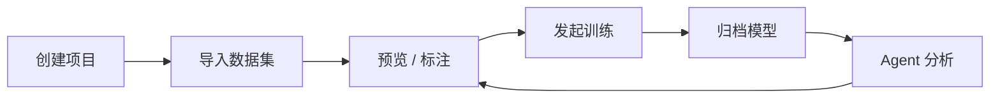

# YOLOps-Agent

YOLOps-Agent 是一个面向目标检测流程的轻量级 YOLOps 工作台，覆盖项目管理、数据集与标注、YOLO 训练、模型归档和 Agent 辅助分析。

这个项目的重点不是做一个“上传图片跑一次模型”的 demo，而是把目标检测项目中更真实的工程链路串起来：从数据准备、标注检查、训练任务，到模型版本和结果分析，形成一个可以本地运行、可以演示、也方便继续扩展的闭环。

## 项目亮点

- 完整目标检测工作流：项目 -> 数据集 / 标注 -> 训练 -> 模型 -> Agent 分析
- 前后端分离工作台：Vue 3 + Vite 构建多页面操作界面，FastAPI 提供业务 API
- YOLO 训练接入：基于 Ultralytics YOLO 发起训练、追踪任务状态并归档产物
- 数据与模型关联：项目、数据集、训练记录、模型版本之间保留清晰关系
- Agent 辅助分析：结合项目上下文，对训练、模型和数据集给出分析与建议
- 单机演示友好：默认 SQLite 和本地磁盘存储，适合课程设计、实习作品和面试展示

## 界面预览

### 全局概览


### Agent 对话


## 技术栈

| 模块 | 技术 |
| --- | --- |
| 前端 | Vue 3, Vite, Vue Router |
| 后端 | FastAPI, Pydantic, SQLModel |
| 训练 | Ultralytics YOLO |
| Agent | LangChain / LangGraph 相关能力 |
| 数据库 | SQLite 默认，PostgreSQL 可切换 |
| 存储 | 本地磁盘保存图片、标注、模型和训练产物 |

## 核心功能

### 数据集与标注

- 数据集创建、导入、版本管理
- YOLO 格式图片和标签读取
- 数据集预览页逐图查看图片和标注框
- 标注工作台支持查看、编辑和保存标注
- 标注状态、数据统计和基础质量检查

### 训练与模型

- 全局训练入口和项目内训练入口
- 训练任务创建、状态追踪和指标展示
- 训练完成后自动归档模型产物
- 模型列表、模型详情和项目绑定关系展示

### Agent 分析

- 基于项目上下文分析训练任务、模型和数据集
- 支持会话式问答和分析建议
- 可用于面试演示“模型训练之后如何复盘和改进”

## 业务流程



推荐演示顺序：

1. 创建或打开项目，说明项目如何承载数据、训练和模型关系。
2. 进入数据集或标注页，展示图片、YOLO 标签和标注状态。
3. 在训练页或项目详情页发起训练任务。
4. 在模型页查看训练产出的模型版本。
5. 进入 Agent 页，让它基于当前项目上下文做结果分析和下一步建议。

## 项目结构

```text
YOLOps-Agent/
├─ backend/                  # FastAPI 后端
│  ├─ app/
│  │  ├─ api/                # API 路由
│  │  ├─ agents/             # Agent 对话、上下文和工具能力
│  │  ├─ annotation/         # 标注读写与处理
│  │  ├─ dataset/            # 数据集导入、统计和版本管理
│  │  ├─ training/           # 训练与评估任务
│  │  ├─ registry/           # 模型归档和管理
│  │  └─ core/               # 配置、数据库、路径等基础能力
│  ├─ .env.example           # 后端环境变量模板
│  └─ requirements.txt
├─ frontend/                 # Vue 3 + Vite 前端
│  ├─ src/
│  │  ├─ api/                # 前端 API 封装
│  │  ├─ components/         # 复用组件
│  │  ├─ layouts/            # 页面布局
│  │  └─ pages/              # 页面视图
│  └─ package.json
├─ docs/                     # 项目文档与 README 截图
├─ AGENTS.md                 # 维护说明
└─ README.md
```

## 本地启动

### 1. 启动后端

```powershell
cd D:\workspace\YOLOps-Agent\backend
python -m venv .venv
.\.venv\Scripts\activate
pip install -r requirements.txt
copy .env.example .env
uvicorn app.main:app --reload --host 127.0.0.1 --port 8000
```

后端默认地址：

- API 服务：`http://127.0.0.1:8000`
- Swagger 文档：`http://127.0.0.1:8000/docs`

### 2. 启动前端

```powershell
cd D:\workspace\YOLOps-Agent\frontend
npm install
npm run dev
```

前端默认地址：

- Web 页面：`http://127.0.0.1:5174`

## 环境配置

后端配置入口是 [backend/.env.example](./backend/.env.example)。

本地演示推荐使用 SQLite：

```env
DB_BACKEND=sqlite
SQLITE_PATH=D:\workspace\YOLOps-Agent\backend\data\yolops.db
```

如果需要连接独立数据库服务，可以切换为 PostgreSQL：

```env
DB_BACKEND=postgres
PG_HOST=127.0.0.1
PG_PORT=55432
PG_USER=yolops
PG_PASSWORD=yolops123
PG_DATABASE=yolops
```

## GitHub 提交边界

仓库建议只提交源码、必要文档、配置模板和小体积截图，不提交运行产物或本地数据。

不建议提交：

- `backend/data/`
- `backend/datasets/`
- `.env`
- `.venv/`
- `node_modules/`
- 训练权重、导出模型和大体积图片

当前 [.gitignore](./.gitignore) 已经覆盖这些主要目录和文件类型。真实业务资源应保存在本地磁盘，不应直接放进 Git。

## 当前定位与限制

这个项目当前定位是实习作品 / 单机演示项目，不是生产级多租户系统。

已知限制：

- 训练和评估仍在后端进程内执行，适合本地演示，不适合生产调度。
- 前端缓存、预取和统一刷新机制还可以继续完善。
- 自动化测试、数据库 migration、CI 和发布前检查流程仍需补强。
- 权限、审计、多用户隔离不是当前阶段重点。

## 面试讲法

可以把项目概括为：

> 我独立完成了一个面向目标检测流程的轻量级 YOLOps 工作台，使用 Vue 3 + FastAPI + SQLite/PostgreSQL，覆盖数据集管理、标注浏览、训练任务、模型归档和 Agent 辅助分析，重点解决训练项目中数据、训练与模型关系混乱的问题。

面试时建议强调三点：

1. 这不是单次推理 demo，而是目标检测工程流程闭环。
2. 数据集、训练任务、模型版本和项目之间有清晰关联。
3. 当前设计服务于单机演示，后续可升级任务队列、缓存策略、测试和数据库迁移。

更多表达参考：

- [docs/实习面试项目讲法.md](./docs/实习面试项目讲法.md)
- [docs/项目实现与架构总览.md](./docs/项目实现与架构总览.md)
- [docs/YOLOps-Agent 打包发布实施清单.md](./docs/YOLOps-Agent%20%E6%89%93%E5%8C%85%E5%8F%91%E5%B8%83%E5%AE%9E%E6%96%BD%E6%B8%85%E5%8D%95.md)

## 后续优化方向

优先级建议：

1. 统一前端缓存、刷新、局部 loading 和骨架屏策略。
2. 将训练 / 评估任务逐步拆成独立 worker。
3. 收紧项目名、训练名、模型名和模型版本说明。
4. 补充关键 API、核心页面测试和数据库 migration。
5. 整理最终打包交付流程。

## 一句话总结

YOLOps-Agent 当前最有价值的地方，是它已经形成了一个可以直接演示、可以讲清楚、也方便继续扩展的目标检测工程闭环。
