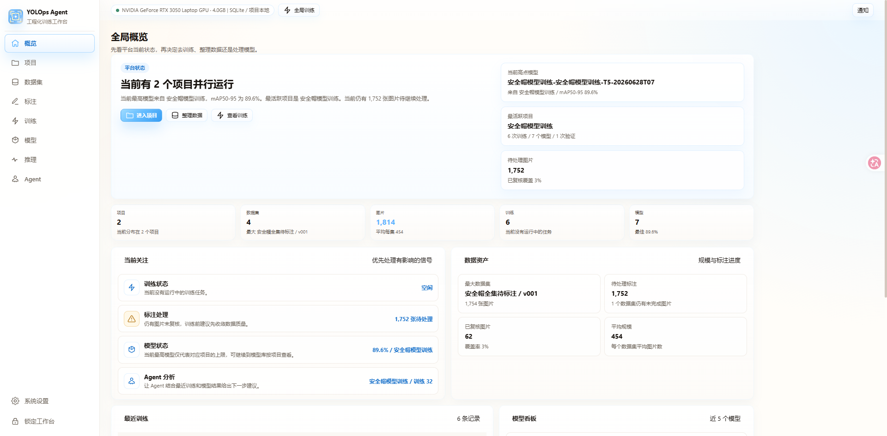
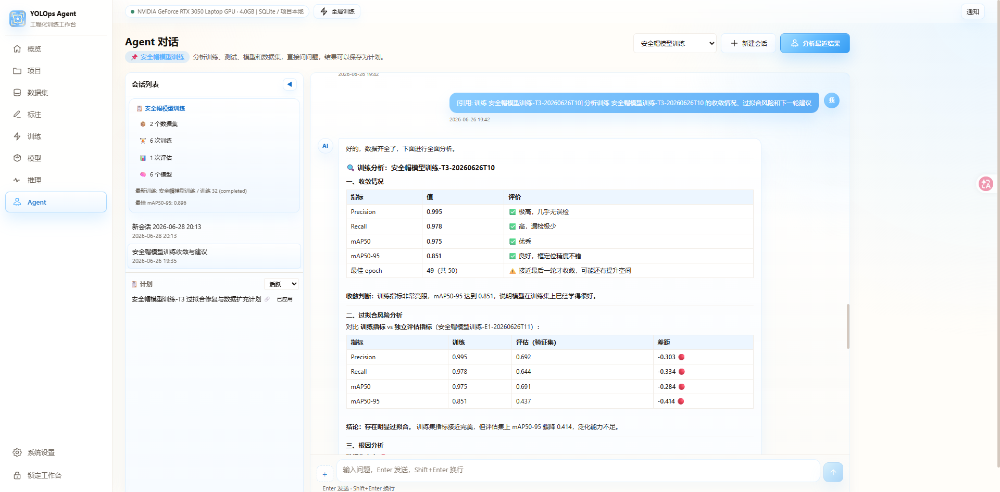

# YOLOps-Agent

面向目标检测流程的轻量级 YOLOps 工作台，覆盖数据集管理、标注浏览、训练任务、模型归档和 Agent 辅助分析。

这个项目的定位是单机工程演示版和实习作品，不是多人生产系统。当前版本重点是跑通一条完整工作流，并把项目、数据集、训练、模型、Agent 之间的关系整理清楚。

## 界面预览

### 全局概览



### Agent 对话



## 项目定位

- 面向目标检测工程流程，而不只是单次推理 demo
- 适合实习项目展示、课程演示、单机本地使用
- 强调数据集、训练、模型、分析之间的闭环

## 技术栈

- 前端：Vue 3 + Vite
- 后端：FastAPI
- 训练：Ultralytics YOLO
- 数据库：SQLite 默认，PostgreSQL 可切换
- 存储：本地磁盘保存图片、标签、模型和训练产物

## 核心功能

- 数据集导入、版本管理和基础质检
- 数据集预览页逐图查看图片与 YOLO 标注框
- 标注工作台编辑框、保存标注、执行预标注
- 全局训练入口和项目内训练任务创建
- 训练过程查看、指标展示、模型归档
- Agent 页面基于项目上下文分析训练、模型和数据集

## 推荐演示路径

1. 进入项目页查看整体概览
2. 打开数据集页或标注页浏览图片和标签
3. 在训练页通过全局入口发起训练
4. 在模型页查看训练产出的模型版本
5. 进入 Agent 页面做结果分析和下一步建议

## 本地启动

### 前端

```powershell
cd D:\workspace\YOLOps-Agent\frontend
npm install
npm run dev
```

访问：`http://127.0.0.1:5174`

### 后端

```powershell
cd D:\workspace\YOLOps-Agent\backend
python -m venv .venv
.\.venv\Scripts\activate
pip install -r requirements.txt
copy .env.example .env
uvicorn app.main:app --reload --host 127.0.0.1 --port 8009
```

后端：`http://127.0.0.1:8009`  
文档：`http://127.0.0.1:8009/docs`

## 数据库切换

项目通过 `backend/.env` 切换数据库：

- 单机演示推荐 `DB_BACKEND=sqlite`
- 多人部署或长期运行可切到 `DB_BACKEND=postgres`

示例配置见 [backend/.env.example](./backend/.env.example)。

## 文档入口

- [CLAUDE.md](./CLAUDE.md)：维护和收尾说明
- [docs/项目实现与架构总览.md](./docs/%E9%A1%B9%E7%9B%AE%E5%AE%9E%E7%8E%B0%E4%B8%8E%E6%9E%B6%E6%9E%84%E6%80%BB%E8%A7%88.md)：唯一详细总览文档
- [docs/实习面试项目讲法.md](./docs/%E5%AE%9E%E4%B9%A0%E9%9D%A2%E8%AF%95%E9%A1%B9%E7%9B%AE%E8%AE%B2%E6%B3%95.md)：面试表达稿
- [docs/YOLOps-Agent 打包发布实施清单.md](./docs/YOLOps-Agent%20%E6%89%93%E5%8C%85%E5%8F%91%E5%B8%83%E5%AE%9E%E6%96%BD%E6%B8%85%E5%8D%95.md)：打包交付清单

## 仓库说明

仓库只建议提交源码、文档和配置模板，不建议提交以下运行产物：

- `backend/data/` 数据库和业务数据
- `backend/datasets/` 本地图片数据
- 训练产物和模型权重
- `.env`、`.venv`、`node_modules/`

## 当前已知限制

- 训练和评估仍由后端进程内任务调度，适合单机使用
- 当前版本更偏演示闭环，不是生产级任务系统
- 自动化测试、正式 migration、发布前检查流程还不完整

## 一句话总结

YOLOps-Agent 现在最有价值的地方，不是功能堆得多，而是它已经形成了一个可以直接演示、可以讲清楚、也方便继续扩展的目标检测工程闭环。
